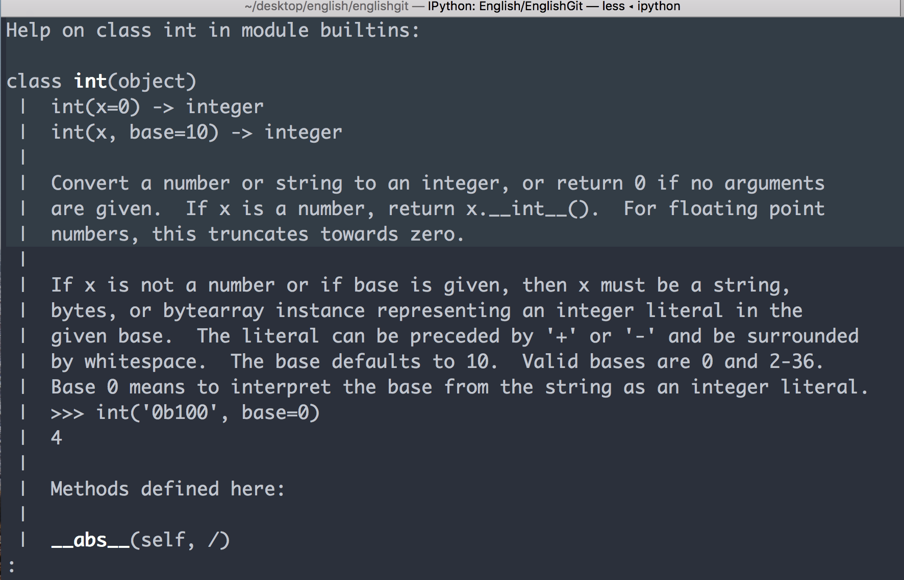

### Chapter 10 Files and Exceptions

#### Alina

2018-06-12

**源代码**

```python
with open('pi_digits.txt') as file_object:
    contents = file_object.read()
    print(contents)
    
#file_object,这里的file_object的命名是提醒,
#open命令是将pi_digits.txt这个电脑中的文件,转换成Python中的Object.
#这样,一个文件就活了起来,能跑会跳,比如有read,write等method,当然也有attribute比如
file_object.name #会输出
pi_digits.txt

with open('pi_digits.txt') as file_object:
    contents = file_object.read()
    print(contents.rstrip())

with open('python_work/text_files/pi_digits.txt') as file_object:
    contents = file_object.read()
    print(contents)

file_path = 'C:/Users/Administrator/Desktop/python_work/text_files/pi_digits.txt'
with open(file_path) as file_object:
    contents = file_object.read()
    print(contents)

filename = 'pi_digits.txt'

with open(filename) as file_object:
    for line in file_object:
        print(line)

filename = 'pi_digits.txt'

with open(filename) as file_object:
    lines = file_object.readlines()

pi_string = ''
for line in lines:
    pi_string += line.strip()

print(pi_string)
print(len(pi_string))

filename = 'pi_million_digits.txt'

with open(filename) as file_object:
    lines = file_object.readlines()

pi_string = ''
for line in lines:
    pi_string += line.strip()

print(pi_string[:52] + '...')
print(len(pi_string))

"Is your birthday contained in pi 游戏"
filename = 'pi_million_digits.txt'

with open(filename) as file_object:
    lines = file_object.readlines()

pi_string = ''
for line in lines:
    pi_string += line.rstrip()

birthday = input("Enter your birthday, in the form mmddyy: ")
if birthday in pi_string:
    print("Your birthday appears in the first million digits of pi!")
else:
    print("Your birthday does not appear in the first million digits of pi.")

Enter your birthday, in the form mmddyy: 121696
Your birthday does not appear in the first million digits of pi.

练习 10-1
filename = 'learning_python.txt'

with open(filename) as file_object:
    for line in file_object:
        print(line.rstrip())

filename = 'learning_python.txt'

with open(filename) as file_object:
    lines = file_object.readlines()

learning_string = ''
for line in lines:
    learning_string += line.rstrip()

print(learning_string)
So far I have learned in python:
variables and simple data types
lists
working with lists
if statements
dictionaries
user input and while loops
functions
classes
10-2
filename = 'learning_python.txt'

with open(filename) as file_object:
    lines = file_object.readlines()

learning_string = ''
for line in lines:
    learning_string += line.rstrip()

print(learning_string.replace('python','C'))
```

**错题集**

```python
我的Windows笔记本写文件地址时可以用 / （forward slash）  不需要改为\ （back slash）
这点真是意外,windows一贯反人性😆.
#关于运行文件,不必总是黏贴复制到ipython
1. 可以在git bash中运行, 
python a_python_file.py #
2. 也可以在ipython中运行. 
!python a_python_file.py #这是ipython提供的便利, 不必先退出ipython回到git bash中,运行文件,然后再回来.
#也可以更加简单,不过这个命令只在ipython中好用
run a_python_file.py
```

今日所学

reading en entire file

file paths

reading line by line

making a list of lines from a file


**如何理解`/` (forward slash) 和`\`back slash**

1. 从形状上, `/`头部超前, 前趋，向前走

   ​                `\`头部朝后, 后仰,也可以理解为转过身向后走. 

   ​

   这是最直观的理解

2. `/` 是向上的阶梯(扶梯),向上攀爬; `\ `是向下的滑梯, 可以理解在 `\n`  `\t`, 中`\`被称为escape character, 顺着滑梯溜走逃逸.

3. 记住在键盘上的位置, 无论是`/`还是`\`, 都表示一段叙述结束,要开始新的或者要收尾.

   比如`"python_work/text_files/"`Python_work这个文件夹结束了,要引出子文件夹,

   或者"This is is text. /n" /n是一段话结束了,回车换行.

   ​

   这样理解有什么用呢? 可以帮助锁定他们在键盘上的位置,

   他们都在键盘的右侧,因此可以表示一段意思的结束.

   另外, 

   `/`在键盘的右下方,说明是在往上走,在攀爬上升阶段, 是上楼的自动扶梯

   `\`在键盘的右上方,是往下走,在下滑阶段,是下楼的自动扶梯. windows偏爱走下坡路这个符号.


建议设置输入法,在中文状态下使用英文标点.


2018-06-13

**源代码**

```python
filename = 'programming.txt'

with open(filename,'w') as file_object:
    file_object.write("I love programming.")

filename = 'programming.txt'

with open(filename,'w') as file_object:
    file_object.write("I love programming.")
    file_object.write("I love creating new game.")

filename = 'programming.txt'

with open(filename,'w') as file_object:
    file_object.write("I love programming.\n")
    file_object.write("I love creating new game.\n")

filename = 'programming.txt'

with open(filename,'a') as file_object:
    file_object.write("I also love finding meaning in large datasets.\n")
    file_object.write("I love creating apps that can run in a browser.\n")

练习：   
10-3
user_name = input("Please enter your name: ")

filename  = 'user_name.md'

with open(filename,'w') as file_object:
    file_object.write(user_name)

10-4
user_name = input("Please enter your name: ")
while user_name:
    print("Welcome! " + user_name.title())
    filename = 'guest_book.txt'
    with open(filename,'a') as file_object:
        file_object.write(user_name + '\n')
    break

10-5
reason = input("Why you like programming? ")
while reason:
    filename = "reason_programming.md"
    with open(filename,'a') as file_object:
        file_object.write(reason + '\n')
    break
```

**错题集**

```python
1
user_name = input("Please enter your name: ")

filename  = 'user_name.md'

with open(filename,'w') as file_object:
    file_object.write(user_name)
filename = 'user_name.md' user.name 后加上文件类型，否则需要选择打开方式
2
user_name = input("Please enter your name: ")
while user_name:
    print("Welcome! " + user_name.title())
    filename = 'guest_book.txt'
    with open(filename,'a') as file_object:
        file_object.write(user_name + '\n')
 使用while loop 忘记break  gitbash 打印个不停.....
```

今日所学

writing to a file

writing multiple lines

appending to a file

2018-06-14

**源代码**

```python
print(5/0)
$ python 2018-06-14.py
Traceback (most recent call last):
  File "2018-06-14.py", line 1, in <module>
    print(5/0)
ZeroDivisionError: division by zero

try:
    print(5/0)
except ZeroDivisionError:
    print("You can't divide by zero!")
You can't divide by zero!

print("Give me two numbers, and I'll divide them.")
print("Enter 'q' to quit.")

while True:
    first_number = input("\nFirst number: ")
    if first_number == 'q':
        break
    second_number = input("\nSecond number: ")
    if seconf_number == 'q':
        break
    anwser = int(first_number)/int(second_number)
    print(answer)

$ python 2018-06-14-1.py
Give me two numbers, and I'll divide them.
Enter 'q' to quit.

First number: 5

Second number: 0
Traceback (most recent call last):
  File "2018-06-14-1.py", line 9, in <module>
    if seconf_number == 'q':
NameError: name 'seconf_number' is not defined

print("Give me two numbers, and I'll divide them.")
print("Enter 'q' to quit.")

while True:
    first_number = input("\nFirst number: ")
    if first_number == 'q':
        break
    second_number = input("\nSecond number: ")
    try:
        answer = int(first_number)/int(second_number)
    except ZeroDivisionError:
        print("You can't divide by 0!")
    else:
        print(answer)

Give me two numbers, and I'll divide them.
Enter 'q' to quit.

First number: 5

Second number: 0
You can't divide by 0!

First number: 5

Second number: 2
2.5

First number: q

```

今日所学

exceptions

handing the ZeroDivisionError Exception

using exceptions to prevent crashes

the else block

**Try and Except**

Try except,  结果导向, 以终为始, 事先考虑到可能遇到的报错.

"EAFP，easier ask for forgiveness than permission"

if (then),条件判断, LBYL，look before your leap三思而后行, 

if elif else,几乎是最有用的逻辑,

但是在一大段代码里全部都是if, else,显得过于单调, 就跟写文章的时候,用同义词一样.

2018-06-15

**源代码**

```python
filename = 'alice.txt'

with open(filename) as f_obj:
    contents = f_obj.read()
Traceback (most recent call last):
  File "2018-06-15.py", line 3, in <module>
    with open(filename) as f_obj:
FileNotFoundError: [Errno 2] No such file or directory: 'alice.txt'

filename = 'alice.txt'

try:
    with open(filename) as f_obj:
        contents = f_obj.read()
except FileNotFoundError:
    msg = "Sorry, the file " + filename + " dose not exist."
    print(msg)
Sorry, the file alice.txt dose not exist.
filename = 'alice.txt'

try:
    with open(filename) as f_obj:
        contents = f_obj.read()
except FileNotFoundError:
    msg = "Sorry, the file " + filename + " dose not exist."
    print(msg)
else:
    # Count the approximate number of words in the file.
    words = contents.split()
    num_words = len(words)
    print("The file " + filename + " has about " + str(num_words) + " words.")


def count_words(filename):

    """Count the approximate number of words in file."""
    try:
        with open(filename) as f_obj:
            contents = f_obj.read()
    except FileNotFoundError:
        msg = "Sorry, the file " + filename + " dose not exist."
        print(msg)
    else:
    # Count the approximate number of words in the file.
        words = contents.split()
        num_words = len(words)
        print("The file " + filename + " has about " + str(num_words) + " words.")

filename = 'alice.txt'
count_words(filename)

def count_words(filename):

    """Count the approximate number of words in file."""
    try:
        with open(filename) as f_obj:
            contents = f_obj.read()
    except FileNotFoundError:
        msg = "Sorry, the file " + filename + " dose not exist."
        print(msg)
    else:
    # Count the approximate number of words in the file.
        words = contents.split()
        num_words = len(words)
        print("The file " + filename + " has about " + str(num_words) + " words.")

filenames = ['alice.txt','siddhartha.txt','moby_dick.txt','little_women.txt']
for filename in filenames:
    count_words(filename)


def count_words(filename):

    """Count the approximate number of words in file."""
    try:
        with open(filename) as f_obj:
            contents = f_obj.read()
    except FileNotFoundError:
        pass
    else:
    # Count the approximate number of words in the file.
        words = contents.split()
        num_words = len(words)
        print("The file " + filename + " has about " + str(num_words) + " words.")

filenames = ['alice.txt','siddhartha.txt','moby_dick.txt','little_women.txt']
for filename in filenames:
    count_words(filename)

The file alice.txt has about 29461 words.
The file moby_dick.txt has about 215136 words.
The file little_women.txt has about 189079 words.
#这些代码就开始实在的做事了.
```

**错题集**

```python
try:
        with open(filename) as f_obj:
        contents = f_obj.read()
    except FileNotFoundError:
        pass
 File "2018-06-15-1.py", line 6
    contents = f_obj.read()
           ^
IndentationError: expected an indented block

    contents前面需要缩进
#关于缩进   
try:
    with open(filename) as f_obj:
        contents = f_obj.read()
 缩进表示逻辑隶属和包含的关系.
with open(filename) as f_obj:
    contents = f_obj.read()
单独一段open的代码,然后再将其放入try的逻辑内,
如果不缩进,
with open(filename) as f_obj:
contents = f_obj.read()
这两段代码是并行关系.
with open(filename) as f_obj: 
#这一行代码open(filename)的同时就自动f_obj.close()
#with open这个写法就是为了帮助我们少写f_obj.close(这一步的语法糖.
#因此后面
contents = f_obj.read()中的f_obj就是没有被定义的命名.

 
Python缩进的优点是,使得代码简洁的逻辑结构,可视化

其他的编程语言会这样写,
with open(filename) as f_obj: {
    contents = f_obj.read()  #这里缩进与否没有关系,是用{} 表示包含和隶属的逻辑关系. 
}
嵌套的逻辑:
try:{
    with open(filename) as f_obj:{
          contents = f_obj.read()  
    }       
}
#表达的逻辑与python完全一样,但是多了{}, 空格是我为了可读性加的. 其实也可以这样
try:{
with open(filename) as f_obj:{
contents = f_obj.read() ;} } #读起来很是心累.
这个就是python中indentation的作用,就是{}, 去掉了形式,留下了本质.
漏掉缩进,相当于
try:{
    with open(filename) as f_obj:
    contents = f_obj.read()      
}
```

今日所学

hand the FileNotFoundError Exception

Analyzing text

working with nultiple files

failing ailently


2018-06-16

**源代码**

```python
10-6
print("Enter two numbres, and I will add them together.")

first_number = input("Please enter the first number: ")
second_number = input("Please enter the second number: ")
result = first_number + second_number
print(result)

Enter two numbres, and I will add them together.
Please enter the first number: 1
Please enter the second number: apple
1apple


print("Enter two numbres, and I will add them together.")

first_number = input("Please enter the first number: ")
second_number = input("Please enter the second number: ")
try:
    result = int(first_number) + int(second_number)
    print(result)
except ValueError:
    print("Sorry you have not enter a number!")

10-7
print("Enter two numbres, and I will add them together.")
print("Enter 'q' to quit")
while True:
    first_number = input("Please enter the first number: ")
    if first_number == 'q':
        break
    second_number = input("Please enter the second number: ")
    if second_number == 'q':
        break
    try:
        result = int(first_number) + int(second_number)
        print(result)
    except ValueError:
        pass

10-8 
def content(filename):
    try:
        with open(filename) as file_object:
            contents = file_object.read()
            print(contents)
    except FileNotFoundError:
        print("The file is missing! ")

    
filenames = ['cats.txt','dogs.txt']
for filename in filenames:
    content(filename)

10-9
def content(filename):
    try:
        with open(filename) as file_object:
            contents = file_object.read()
            print(contents)
    except FileNotFoundError:
        pass

    
filenames = ['cats.txt','dogs.txt']
for filename in filenames:
    content(filename)
```

**错题集**

```python
print("Enter two numbres, and I will add them together.")

first_number = input("Please enter the first number: ")
second_number = input("Please enter the second number: ")
result = first_number + second_number
print(result)

Enter two numbres, and I will add them together.
Please enter the first number: 1
Please enter the second number: apple
1apple

加工数字需要 function int()

#这是因为从外部获得的内容都是文本,不管是从键盘输入的,还是从文件里读取的.
#都是文本,也就是他们都是 " "在双引号里面的.
In [1]: first_number = input("Please enter the first number: ")
Please enter the first number: 3
In [2]: first_number
Out[2]: '3' #Tada,看见没, 3是被双引号包裹着的.
In [3]: "3" + "2"
Out[3]: '32' #这是将两个字符串合并到一起.
In [4]: "a" + "b"
Out[4]: 'ab'
#python或者说编程就是将外部输入的文本转换成1) 数据 (data) 2) 命令 (command)

In [5]: int(first_number)
Out[5]: 3
#int, integer是Python预先写好的一个Class, 能将文本转换成整数
#可以查看一下int
In [6]: help(int)
#会出现下面的对话框
```



在 冒号 `:` 这里闪烁光标, 输入字母 q 是退出,回到原来的ipython界面中.

以后会常用到help() 函数, 稍微熟悉一下这个界面

按空格键是向下翻页, 按b(before)是向前翻页.

按字母g是回到首页, shift + g (也就是大写字母G)是调到尾页.

```python
Help on class int in module builtins:

class int(object)
 |  int(x=0) -> integer
 |  int(x, base=10) -> integer
 |  
 |  Convert a number or string to an integer, or return 0 if no arguments
 |  are given.  If x is a number, return x.__int__().  For floating point
 |  numbers, this truncates towards zero.
```

看到没,`int`是一个`class`, 也是继承自`object`, 他能将文本转换成数字(整数)

所以, `int("3")` 与第九章的 `Dog('willie')` 的本质是一样的. 都是接收argument,将其转成实例(Instance).让其活起来.

> 这里可以说转化成实例Instance, 也可以说转化成实例对象 Instance object, 因为在Python中,万物皆对象,
>
> 不要被迷惑了,这个Object是多余的.
>
> 比如 3, 我们可以说整数3, 也可以说整数对象3, 因为大家都是继承自object,都是从同一个母体里出来的.
>
> 比如之前写的`file_object`之所以这样命名,是将python中的file与没被Python处理的File区分开.

将一个文本`'3'` 转换成 整数`3` 这个Object Instance.

当然,我们在ipython和vscode中输入的数字都是 数字Object, 而不是文本.

```python
In [19]: number_object = 10
#查看一下他的attribute and method
#下面有这么多,
#怎么说呢? 我们用的每一个小的工具,后面都有人做了大量的工作.
In [20]: dir(number_object)
Out[20]: 
['__abs__',
 ....
 'bit_length',
 'conjugate',
 'denominator',
 'from_bytes',
 'imag',
 'numerator',
 'real',
 'to_bytes']
#这些不需要去了解,放在这里只是为了说明, 
#需要将输入的文本 "3" 转换成 整数`3`

```

input的出来

```python
#可以分成两步
In [23]: first_number = input("Please enter the first number: ")
Please enter the first number: 3
In [24]: int(first_number)
Out[24]: 3
#一般情况下,都是简写成一步,
first_number = int(input("Please enter the first number: "))
In [26]: first_number = int(input("Please enter the first number: "))
Please enter the first number: 3
In [27]: first_number *3
Out[27]: 9
#当然,在程序员看来,用户都是傻子,他们什么都会乱输入.
#比如
In [28]: first_number = int(input("Please enter the first number: "))
Please enter the first number: &
---------------------------------------------------------------------------
ValueError                                Traceback (most recent call last)
<ipython-input-28-6e96b84aae4f> in <module>()
----> 1 first_number = int(input("Please enter the first number: "))
ValueError: invalid literal for int() with base 10: '&'

#这个时候try就来了.对用户的输入验证其有效性(Verify and validate),教育用户.
try:
    first_number = int(input("Please enter the first number: "))
except ValueError:
    print("You should input an integer, please try again.")
##运行一次.
In [29]: try:
    ...:     first_number = int(input("Please enter the first number: "))
    ...: except ValueError: #替换原来的报错内容, 换成我想要说的内容.
    ...:     print("You should input an integer, please try again.")
    ...:     
Please enter the first number: y
You should input an integer, please try again.
#运行一次,停止了,没有给用户机会从新输入.
#使用一个while循环.
while True:
    try:
        first_number = int(input("Please enter the first number: "))
        break #如果输入正确,就跳出循环.
    except ValueError:
        print("You should input an integer, please try again.")
        continue #如果不正确,就给用户机会再来一遍.
#运行.
In [30]: while True:
    ...:     try:
    ...:         first_number = int(input("Please enter the first number: "))
    ...:         break #如果输入正确,就跳出循环.
    ...:     except ValueError:
    ...:         print("You should input an integer, please try again.")
    ...:         continue #如果不正确,就给用户机会再来一遍.
    ...:     
Please enter the first number: u
You should input an integer, please try again.
Please enter the first number: j
You should input an integer, please try again.
Please enter the first number: 7

In [31]: #输入正确,跳出循环

#在这里,就是用程序控制用户,这也是编程乐趣所在.

```


`help()` 是一个很便利的函数, 任何不了解的内容可以`help()`


今日所学

完成练习

2018-06-17

**源代码**

```python
import json

numbers = [2,3,4,5,7,11,13]

filename = 'numbers.json'
with open(filename,'w') as f_obj:
    json.dump(numbers,f_obj)

    
import json

filename = 'numbers.json'
with open(filename) as f_obj:
    numbers = json.load(f_obj)

print(numbers)


import json
username = input("What is your name? ")

filename = 'username.json'
with open(filename,'w') as f_obj:
    json.dump(username,f_obj)
    print("We will remember you when you come back, " + username + "!")
What is your name? Alina
We will remember you when you come back, Alina!

import json
filename = 'username.json'

with open(filename) as f_obj:
    username = json.load(f_obj)
    print("Welcome back, " + username + "!")
Welcome back, Alina!


import json

#load the username, if it has been stored previously.
#Otherwise, prompt for the username and store it.
filename = 'username.json'
try:
    with open(filename) as f_obj:
        username = json.load(f_obj)
except FileNotFoundError:
    username = input("What is your name? ")
    with open(filename,'w') as f_obj:
        json.dump(username,f_obj)
        print("We will remember you when you comeback, " + username + "!")
else:
    print("Welcome back, " + username + "!")

Welcome back, Alina!


import json

def greet_user():
    """Greet the user by name."""

    filename = 'username.json'
    try:
        with open(filename) as f_obj:
            username = json.load(f_obj)
    except FileNotFoundError:
        username = input("What is your name? ")
        with open(filename,'w') as f_obj:
            json.dump(username,f_obj)
            print("We will remember you when you comeback, " + username + "!")
    else:
        print("Welcome back, " + username + "!")
greet_user()


import json

def get_stored_username():
    """Get stored username if available"""
    filename = 'username.json'
    try:
        with open(filename) as f_obj:
            username = json.load(f_obj)
    except FileNotFoundError:
        return None
    else:
        return username

def greet_user():
    """Greet the user by name."""
    username = get_stored_username()
    if username:
        print("Welcomeback, " + username + '!')
    else:
        username = input("What is your name? ")
        with open(filename,'w') as f_obj:
            json.dump(username,f_obj)
            print("We will remember you when you comeback, " + username + "!")
    
greet_user()


import json

def get_stored_username():
    """Get stored username if available"""
    filename = 'username.json'
    try:
        with open(filename) as f_obj:
            username = json.load(f_obj)
    except FileNotFoundError:
        return None
    else:
        return username
def get_new_username():
    """Prompt for a new username."""
    username = input("What is your name? ")
    filename = 'username.json'
    with open(filename,'w') as f_obj:
        json.dump(username,f_obj)

def greet_user():
    """Greet the user by name."""
    username = get_stored_username()
    if username:
        print("Welcomeback, " + username + '!')
    else:
        username = get_new_username()
        print("We will remember you when you comeback, " + username + "!")
    
greet_user()
感觉重组之后代码反而变长了，一个函数只做一件事情,逻辑清晰了一些
```

**问题集**

What is json?

*JSON is* **short for JavaScript Object Notation***, and is a way to store information in anorganized, easy-to-access manner. In a nutshell, it gives us a human-readable collectionof data that we can access in a really logical manner.* 

看教材内容 感觉json既是一种文件格式，开头的import json中  json又是一个module.

今日所学：

storing data

using json.sump() and json.load()

saving and reading user_generated data

refactoring